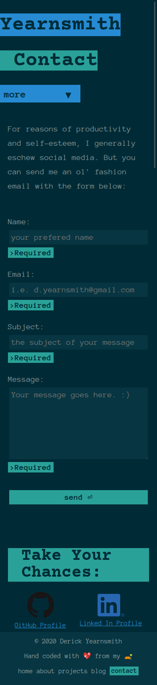

# Derick Yearnsmith Portfolio

## Table of Contents

1. [location](#location)
1. [Description](#description)
1. [Purpose](#purpose)
1. [Functionality/features](#Functionality)
1. [Sitemap](#sitemap)
1. [Target Audience](#target-audience)
1. [Tech Stack](#tech-stack)
1. [Screenshots](#screenshots)

## Location

### URL

 [https://www.derick-yearnsmith-t1a2.netlify.app](https://github.com/Yearnsmith/derick-yearnsmith_T1A2)

### GitHub Repository

[https://github.com/Yearnsmith/derick-yearnsmith_T1A2](https://github.com/Yearnsmith/derick-yearnsmith_T1A2)

## Description

A portfolio website for potential employers

## Purpose

- To display my skill as a developer through a live example and demonstration.
- To learn basic Scss

## Functionality

- 4 interlinking HTML5 pages
- [Semantic HTML](#semantic-tags)
- [Accessible HTML](#accessible-features)
- Mobile written Mobile First
- CSS `@Media` Breakpoints for display accross devices
- CSS Flexbox and Grid used for responsive design
- Scss utilised to style pages in CSS
  - `@mixin`s and `partial`s used to separate code and implement DRY process.
- CSS animation to engage users on entry to site
- Solarized colour scheme utilised throughout to:
  - Give consistent theme to site
  - Engage target audience
  - Implement "Don't reinvent the wheel"
- `::before` & `::after` utilised to:
  - generate dynamic text for blog metadata
  - generate form hints
- SRI
- Links to professional profiles

### Semantic Tags

- html `DOCTYPE` with `lang` attribute
- `header`
- `nav`
- `main`
- `article`
- `section` (within `article`)
- `anchor` with `download` attribute for Resume
- `aside`
- `footer`

### Accessible Features

- 'Skip-to-main' link at top of page
  - placed off page by default. Appears with :focus.
  - Accessible for keyboard users
- Images purely for presentation are given the `role="presentation"` ARIA attribute

## Sitemap

## Target Audience

- Future employers
- Future colleagues
- Industry peers

## Tech Stack

### Languages

- HTML
- CSS (Scss)
- Javascript

### Deployment

- GitHub (Host)
- Netlify (Deployment Platform)

### Source Control
- Git

## Screenshots

### index.html

### about.html

### projects.html

### blog.html

### contact.html

